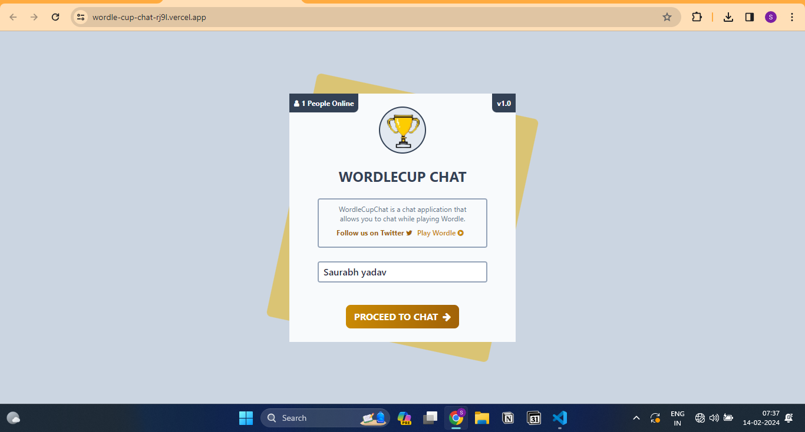

# WORDLECUP-CHAT

## Introduction

Chatting is always fun, but if it is while playing wordle - 🤌

## Tech Stack:

Frontend: ReactJS, TailwindCSS
Backend: Nodejs, SocketIO
Third Party: Hosted PubSub from Azure

## Demo

[Demo Link](https://wordle-cup-chat-rj9l.vercel.app/)

## Install

> cd web && npm start

> cd api && npm run dev

### Envoirnment

Rename .env.local as .env in /api

## Screenshot

- Home Page:

- Chat Page:

